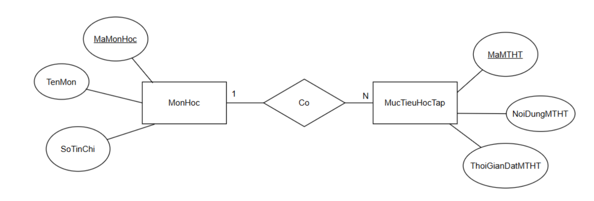
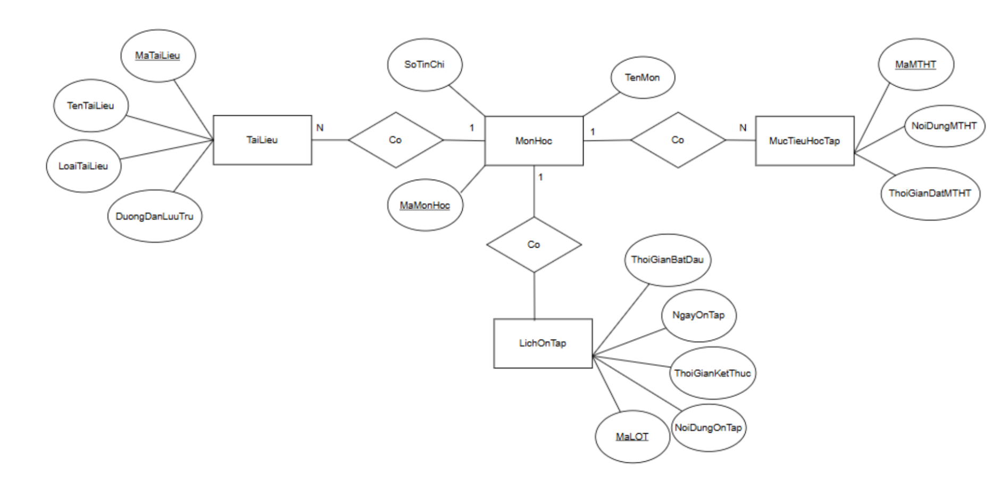
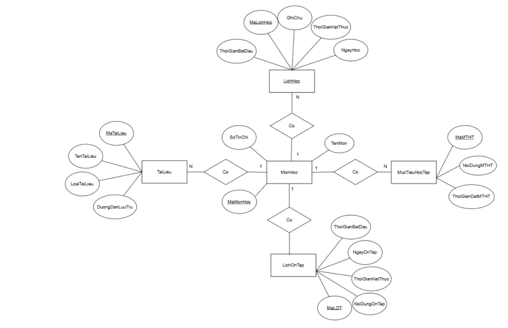

## Bài 1

- **Các thực thể**: `Sinh viên`, `Môn Học`,`Mục tiêu học tập`. 

- **Thuộc tính**:
    - `Sinh viên` : `MaSV`, `TenSV`.
    - `Môn Học` : `MaMonHoc`, `TenMonHoc`, `SoTinChi` .
    - `Mục tiêu học tập`: `MaMucTieu`, `NoiDungMucTieu` .

- **Mối quan hệ**: 
    - `Sinh viên` - `Môn học`: Một nhiều (1-N).
    - `Môn học` - `Mục tiêu học tập`: Một nhiều (1-N).

## Bài 2

## Bài 3

## Bài 4

## Bài 5

## Bài 6

